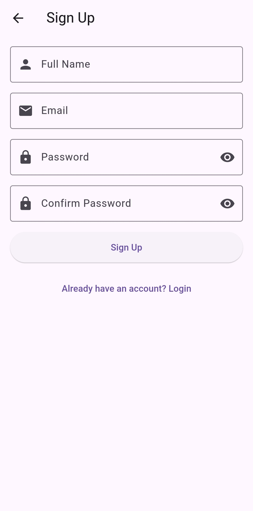
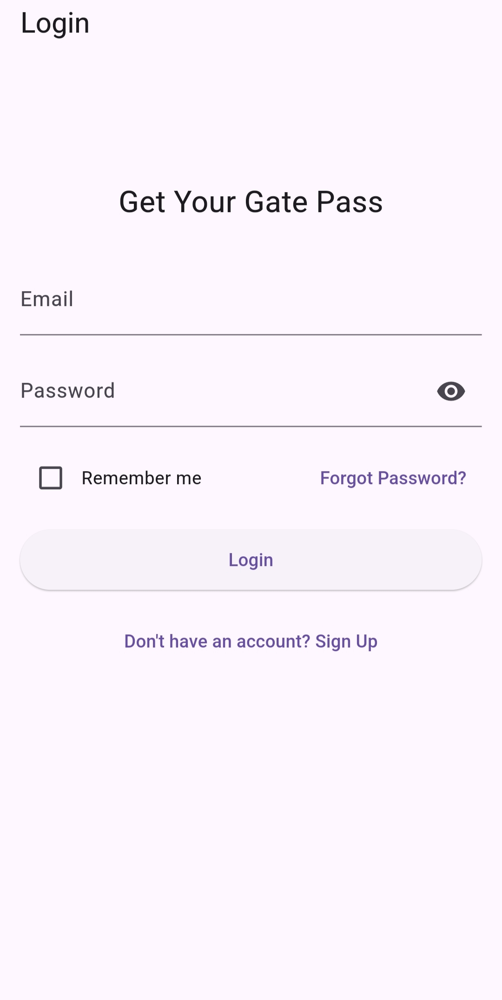
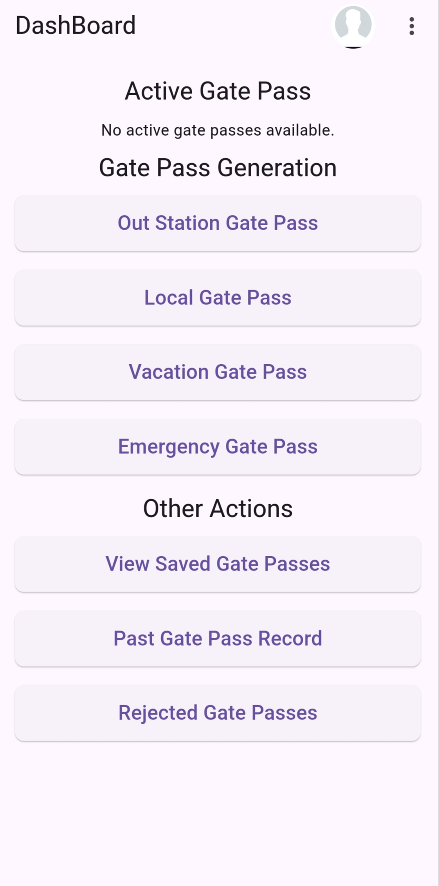
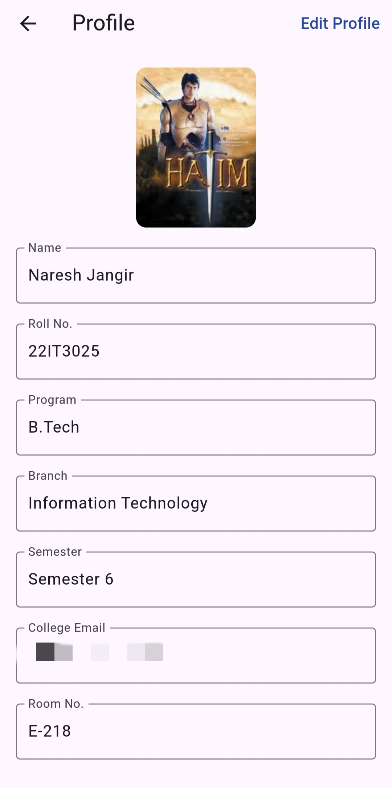
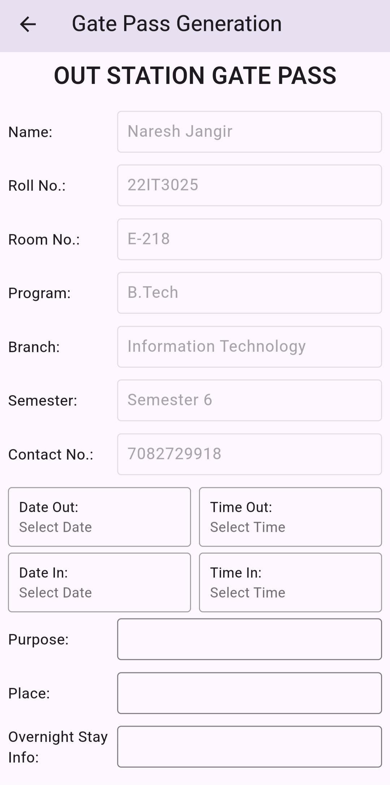
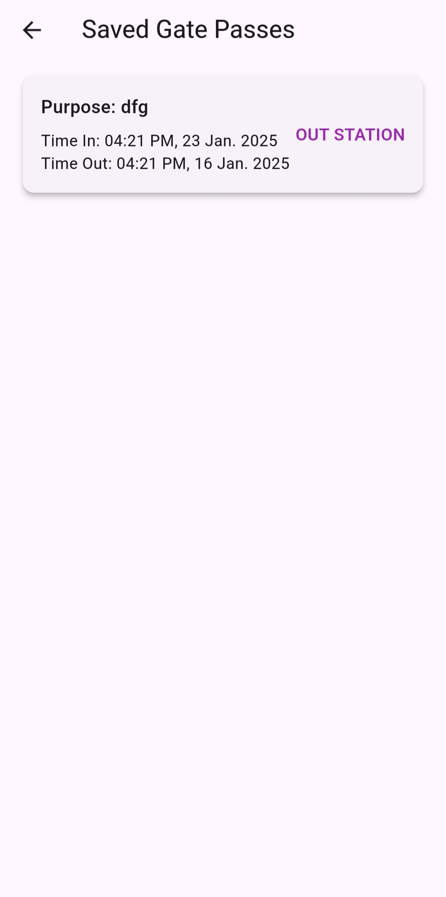
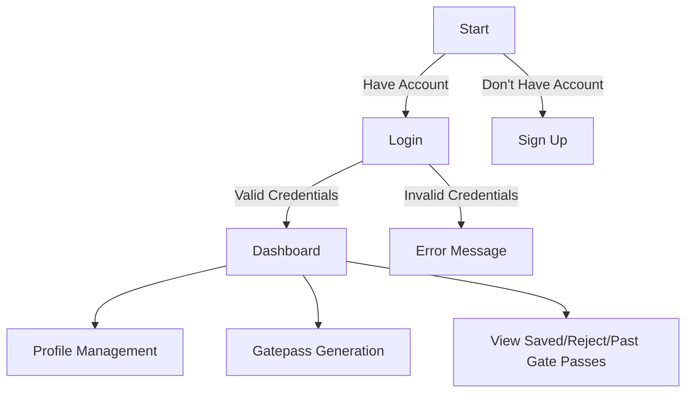
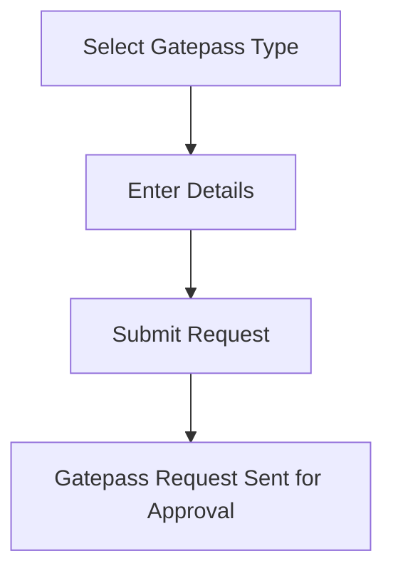

# Student App

Welcome to the **Student App** ! This  project is the part of **Gate Pass Automation Ecosystem**, designed to streamline the process of managing student profiles, authentication, and gatepass generation. The app is built using Flutter and integrates Firebase for backend services.

---

## Table of Contents

1. [Overview](#overview)
2. [Features](#features)
3. [Installation](#installation)
4. [Usage](#usage)
5. [Screenshots](#screenshots)
6. [Flowcharts](#flowcharts)
7. [Technologies Used](#technologies-used)
8. [Contributing](#contributing)
9. [License](#license)

---

## Overview

The **Student App** simplifies student-related activities such as:

- Managing profiles
- Generating and displaying gatepasses
- Secure authentication
- Tracking past and upcoming gatepasses

This app ensures efficient and user-friendly operations for students and administrators.

---

## Features

- **User Authentication**: Login and sign-up functionalities.
- **Profile Management**: View and edit personal profiles.
- **Gatepass Generation**:
  - Local Gatepasses
  - Vacation Gatepasses
  - Emergency Gatepasses
- **Gatepass Tracking**:
  - View upcoming gatepasses
  - Display past and rejected gatepasses

---

## Installation

1. Clone the repository:
   ```bash
   git clone https://github.com/your-repo/student-app.git
   ```
2. Navigate to the project directory:
   ```bash
   cd student-app
   ```
3. Install dependencies:
   ```bash
   flutter pub get
   ```
4. Run the app:
   ```bash
   flutter run
   ```

---

## Usage

1. Launch the app on your preferred device or emulator.
2. Sign up or log in with your credentials.
3. Navigate through the app to:
   - Edit your profile
   - Generate and manage gatepasses
   - View past and upcoming gatepasses

---

## Screenshots

| SignUp Page                                      | Login Page                                      |
|-------------------------------------------------|-----------------------------------------------|
|      |       |

| Home Page                                       | Profile Management                             |
|-------------------------------------------------|-----------------------------------------------|
|          |  |

| Gate Pass Generation Page                       | Saved Gate Passes Page                        |
|-------------------------------------------------|-----------------------------------------------|
|  |  |

---

## Flowcharts

### User Authentication Flow


### Gatepass Generation Process


---

## Technologies Used

- **Frontend**: Flutter
- **Backend**: Firebase
- **Version Control**: Git

---

## Contributing

Contributions are welcome! Follow these steps to contribute:

1. Fork the repository.
2. Create a new branch:
   ```bash
   git checkout -b feature-name
   ```
3. Commit your changes:
   ```bash
   git commit -m 'Add feature name'
   ```
4. Push to the branch:
   ```bash
   git push origin feature-name
   ```
5. Create a pull request.

---

## Author
Naresh Jangir

Contact: nareshjangir6184@gmail.com

---
